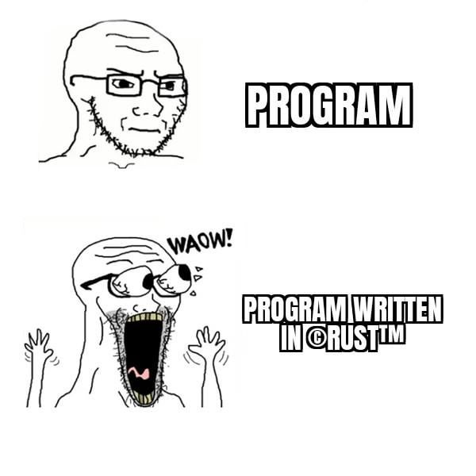

# rrc

A dependency-based service manager for Linux, written in Rust. Inspired by OpenRC.

**Status: early work in progress.** It finds unit files, validates them, and runs
`oneshot` services, moving each through a checked state machine. Long-running
services, stopping them, and the dependency graph are not implemented yet.



## Try it

```bash
cargo run -p rrc-sup -- examples/services
```

```
farewell -> Starting
bye from farewell
farewell -> Started
greet -> Starting
hello from greet
greet -> Started
```

A unit file looks like this (see `examples/services/`):

```toml
[service]
name = "greet"
desc = "prints a greeting"
provides = []
deps = []
runlevels = []

[exec]
kind = "oneshot"
start = ["/bin/echo", "hello from greet"]
```

## Development

```bash
just hooks    # fmt on commit; clippy, unused deps and tests on push
just test
just ci       # everything CI checks
```

`just --list` shows the rest. The recipes are plain cargo commands, so
[just](https://github.com/casey/just) is a convenience, not a requirement.

`rrc-core` holds the domain types and the state machine, `rrc-cfg` parses unit
files, `rrc-sup` runs the services.
